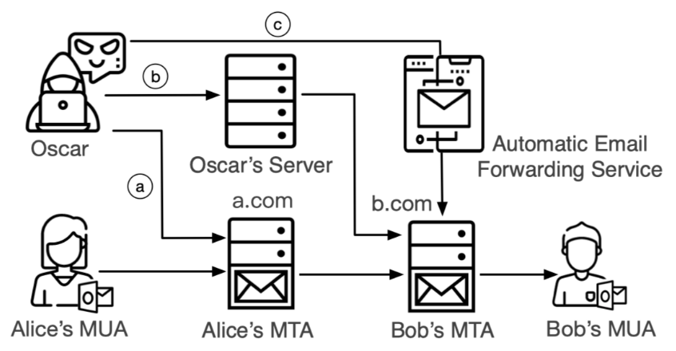
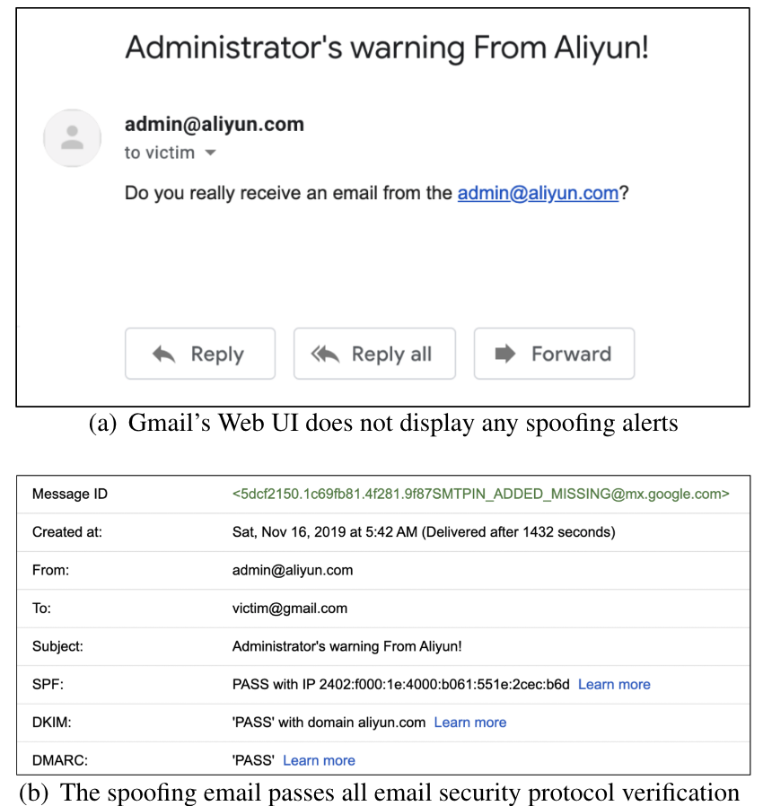
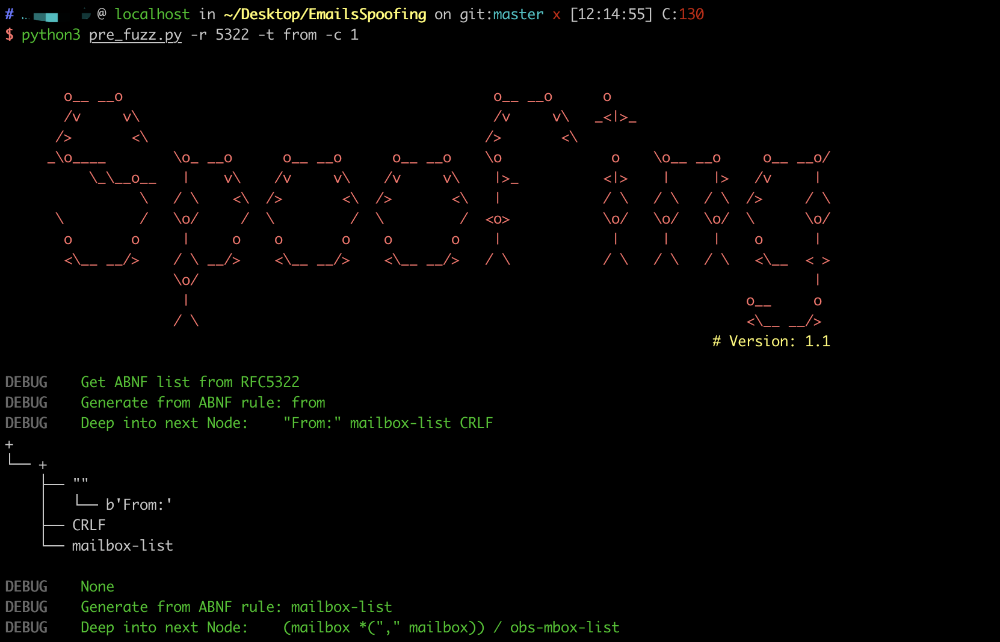
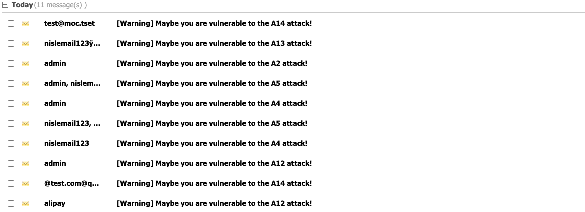

# EmailSpoofingTestTools

> This tool is based on our latest research,"Weak Links in Authentication Chains: A Large-scale
> Analysis of Email Sender Spoofing Attacks", accepted at USENIX Security '21.

EmailSpoofingTestTools is a fuzzing tool for email sender spoofing attacks. This fuzzing tool can generate a number of test samples based on the ABNF grammar for authentication-related headers. Besides, we also provide an evaluation module to help email administrators to evaluate and increase their security. 

Our research systematically analyzes the email delivery process based on the four key stages of authentication: sending authentication, receiving verification, forwarding verification and UI rendering. 

As shown in the figure below, we define three types of email sender spoofing attacks: a. Shared MTA Attack, b. Direct MTA Attack. c. Forward MTA Attack. Furthermore, we found 14 email spoofing attacks capable of bypassing SPF, DKIM, DMARC, and user-interface protections. 

<div align=center></div>

By conducting a "cocktail" joint attack, a spoofing email can completely pass all prevalent email security protocols, and no security warning is shown on the receiver’s MUA.  Therefore, it is challenging to identify whether such an email is spoofing, even for people with a senior technical background.

The following figure shows a spoofing example to impersonate admin@aliyun.com via Gmail. All the three email security protocols give "pass" verification results to the spoofing email.

<div align=center></div>


## Install

- Make sure have python3 installed in your computer.
- Download this tool

```bash
git clone https://github.com/EmailTestTools/EmailTestTools.git
```

- Install dependencies

```bash
sudo pip install -r requirements.txt
```

## Configure

- Set the recipient address in `config.py`

  ```python
  # Change receiveUser to what you like to test.
  receiveUser = "xxx@gmail.com"
  ```

- Configure your email  account in `config/account.json`.

```json
{
  "gmail.com": {
    "user": "test@test.com",
    "apipass": "apipass",
    "passwd": "passwd",
    "smtp_server": "mail.test.com:25",
    "imap_server": "imap.test.com:143",
    "pop3_server": "pop.test.com:110",
    "ssl_smtp_server": "mail.test.com:465",
    "ssl_imap_server": "imap.test.com:993",
    "ssl_pop3_server": "pop.test.com:995"}
}
```

You can configure more than one account, and designate sending account in `config.py `.

```python
# The domain name to be tested
target_domain = "gmail.com"
```

## Fuzzing 

#### 1. Generate malformed From headers.

[pre_fuzz.py](./pre_fuzz.py) will automatically  grab the ABNF rules in the relevant email specifications and generate test samples according to the ABNF rules. Since common mail services usually refuse to handle emails with highly deformed headers, we have specified set certain values for our empirical experiment purposes. Besides, we also introduced the common mutation methods in the protocol fuzz, such as header repeating, inserting spaces, inserting Unicode characters, header encoding, and case variation
**Usage:**

| Short Form | Long Form | Description                                                  |
| ---------- | --------- | ------------------------------------------------------------ |
| -r         | --rfc     | The RFC number of the ABNF rule to be extracted.             |
| -t         | --target  | The field to be fuzzed in ABNF rules.                        |
| -c         | --count   | The amount of ambiguity data that needs to be generated according to ABNF rules. |

**Example:**

```bash
python3 pre_fuzz.py -r 5322 -t from -c 255
```

**Screenshots:**

<div align=center></div>

**Generated Test Sample:**

```json
"From :,()<key@ymail.com>(comment),(\r\n)\r\n",
"From: <=?utf-8?RnJvbTp3b3Jkd29yZCgNCik8YXR0YWNrZXJAdG9wLmNvbT4sQWxpY2VAeW1haWwuY29tLHdlYm1hc3RlckBsaXZlLmNvbSxhZG1pbkBpY2xvdWQuY29tLHNlY3VyaXR5QHNvaHUuY29tDQo==?=>\u0000@attack.com",
"From: <=?utf-8?RnJvbTooY29tbQ0KZW50KTxockBtc24uY29tPix3b3Jkd29yZChoaSk8TWlrZUBhbGl5dW4uY29tPix3b3JkPGFkbWluQGhvdG1haWwuY29tPihoaSksd29yZHdvcmR3b3JkKCk8QHFxLmNvbTpAMTYzLmNvbTpzZWN1cml0eUBhbGl5dW4uY29tPihjb21tDQplbnQpDQo==?=>\u0000@attack.com",
"From:Bob@aliyun.com,(),,,word<attacker@foxmail.com>\r\n",
" FrOM: <Oscar@attack.com>\r\nFrom:(comm\r\nent)<@qq.com:@163.com:Alice@foxmail.com>,word<attacker@live.com>,word(comment)<hr@sina.com>(comm\r\nent)\r\n",
" Fromÿ: <Oscar@attack.com>\r\nFrom:key@msn.com\r\n",
" Fromÿ: <Oscar@attack.com>\r\nFrom:(\r\n)<@gmail.com:@b.com:webmaster@live.com>,word(comment)<@qq.com:@163.com:webmaster@126.com>,<@a.com:@b.com:Alice@139.com>(comment)\r\n",
"From :,(\r\n),Mike@china.com,word<key@163.com>(comm\r\nent),\r\n",
"From:()<@a.com:@b.com:security@ymail.com>(comm\r\nent)\r\n",
"From: <Oscar@attack.com>\r\nFrom:(comm\r\nent),key@sohu.com\r\n",
" From:,,(comment),webmaster@sina.cn,(hi)\r\n",
"From: ,<@gmail.com:@b.com:admin@china.com>,(hi)<@gmail.com:@b.com:attacker@msn.com>,(hi),,(),\r\n",
"From: (hi)<Alice@msn.com>(),security@aliyun.com,word(comment)<@a.com:@b.com:Bob@ymail.com>(),word<Bob@outlook.com>(\r\n)\r\n",
" Fromÿ: <Oscar@attack.com>\r\nFrom:,key@139.com,,(hi),,(),\r\n",
...
```

For more test samples, please check this [file](https://github.com/EmailTestTools/EmailTestTools/blob/master/config/fuzz.json).

#### 2. Send spoofing emails with malformed sender address

[run_test.py](./run_test.py) will use the generated samples to test the security verification logic of the target mail system. We also carefully control the message sending rate with intervals over 10 minutes to minimize the impact's target email services.

You can choose **Shared MTA** or **Direct MTA** to send spoofing emails. At the same time, you can also choose **MIME From** or **MAIL From**  header to test.

| Short Form | Long Form | Description                                       |
| ---------- | --------- | ------------------------------------------------- |
| -m         | --mode    | Attack mode ( SMTP: Shared MTA, MTA: Direct MTA). |
| -t         | --target  | The target field to test. (MIME / MAIL )          |

For example, if you want to use Direct MTA to fuzz MIME From header, you can execute:

```bash
python3 run_test.py -m MTA -t MIME
```

By the way, if you want to use Shared MTA , you need to configure  email sending account in `config/account.json` and `config.py`.

#### 3. Analyze and summarize the employed adversarial techniques

We analyze and summarize the employed adversarial techniques that make email sender spoofing successful in practice.  We use two scripts to verify vulnerabilities in the real world.

[smtp_send.py](./smtp_send.py) simulates as user's MUA to Sender's MTA via SMTP protocol (**Shared MTA**). It is to test the security issues of the Sender's MTA and test whether the receiver can accept the abnormal emails.

[mta_send.py](./mta_send.py) simulate as Sender's MTA to communicate with Receiver's MTA (**Direct MTA**). This tool can be simulated as any email sender and can test receiver's security.

## Evaluation 

We provide an evaluation  tool to help email administrators to evaluate and strengthen their security. After configuring the target email system information, this tool will try to interact with the target system and evaluate whether it is vulnerable to the attacks we found. For the vulnerable attacks, administrators can configure corresponding filtering rules to defend against attacks.

- Configure the recipient address and your email  sending account.

- Just excute:

  ```bash
  python3 evaluate.py 
  ```

  The program will use both shared MTA and direct MTA methods to try to send forged emails to the recipient.

- Check whether these emails are in the inbox of the recipient account.

The body of these forged emails contains detailed information about each header in email and corresponding defense measures, such as rejecting the letter, providing security warnings on the front end, etc. If a forged email enters the inbox of the target mail system, the administrator can easily understand the attack principle and take effective measures to defend it.

It should be noted that when using Direct MTA to test, some email headers need to be manually specified in some email spoofing attacks. So you may need to configure these headers' default values in `config.py`. 

```python
# Some default values in Direct MTA Attack when the attack does not specify these parameter values
mail_from = 'xxx@test.com'
mime_from = 'xxx@test.com'
reply_to = mime_from
sender = "xxx@test.com"
to_email = 'xxx@gmail.com'
subject = 'This is subject'
content = """This is content"""
helo = 'test.com'
```

The following is an example of using this tool to evaluate the security of the target email system.

You can see that some spoofing emails have entered the inbox of the target email system. This means that the target system may be  vulnerable to the corresponding attacks




You can get more information by reading the content of the email, including details of the attack and how to fix such vulnerabilities.


## Version

Current version is 1.2